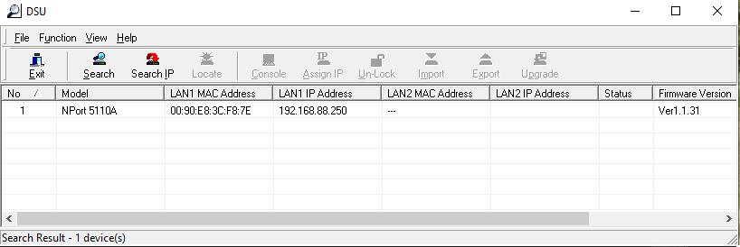
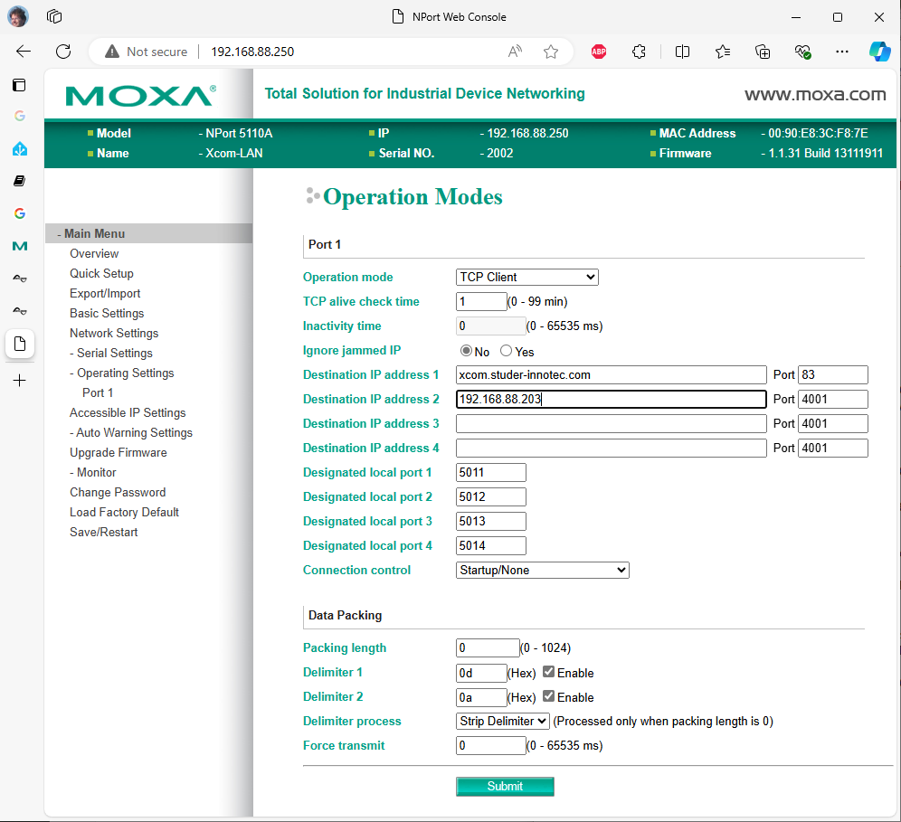

[](LICENSE)
[](https://www.buymeacoffee.com/ankohanse)


# aioxcom

Python library for retrieving sensor information from Studer-Innotec devices.
This component connects directly over the local network using the Studer xcom protocol.

The custom component was tested with:
- Xtender XTH 8000-48 (but should also work for other XTH, XTS and XTM)
- Xcom-CAN (BSP connection to a third party BMS)
- Xcom-LAN (which actually is a Xcom232i with a Moxy NPort 5110A)
- RCC-03

It should also be able to detect and handle
- Studer BMS
- VarioTrack
- VarioString
- RCC-02

Disclaimer: this library is NOT created by Studer-Innotec, but is based on their documentation of the Xcom protocol.
That documentation can be found on:
[Studer-Innotec Download Center](https://www.studer-innotec.com/en/downloads/) *-> Software and Updates -> Communication protocol Xcom-232i*


# Prerequisites

This device depends on having a Studer Xcom-LAN (i.e. an Xcom-232i and a Moxa ethernet gateway) acting as a Xcom client and connecting to this integration. For older systems this will be a separate component, for future systems Studer have indicated that LAN connection will become part of the Xtender range.

The Studer Xcom-LAN will be able to simultaneously send data to the Studer online portal as well as sending data to this integration.

Configuration steps:

1. Download and install the Moxa DSU tool (Device Search Utility)
    - Open [www.moxa.com](https://www.moxa.com) in a browser
    - Select Support -> Software and Documentation
    - Choose NPort 5100A series (or whatever specific device you have)
    - Scroll down under 'Related Software, Firmware and Drivers' to find 'Device Search Utility'
    - Download and install the utility

2. Locate the Moxa NPort device on the local network
    - Run the Moxa Device Search Utility
    - Press the 'Search' button and wait until the search finishes
    - The utility should display the found NPort device
    - Double click on the found device to open its configuration page

      

3. Configure the Moxa NPort device
    - In the Main Menu, select 'Operating Settings' -> Port 1
    - Verify that 'Operation Mode' is set to 'TCP Client'
    - Add the ip-address or network name of your HomeAssistant as 'Destination IP address'
    - Press the 'Submit' button
    - Press 'Save/Restart'

      


# Usage

The library is available from PyPi using:
`pip install aioxcom`

To read an infos or param or write to a param:

```
from aioxcom import XcomApiTcp, XcomDataset, VOLTAGE

dataset = await XcomDataset.create(VOLTAGE.AC240) # or use VOLTAGE.AC120
info_3023 = dataset.getByNr(3023, "xt")  # the "xt" part is optional but usefull for detecting mistakes
info_6001 = dataset.getByNr(6001, "bsp")
param_1107 = dataset.getByNr(1107, "xt")
dataset = None  # Release memory of the dataset

api = XcomApiTcp(4001)    # port number configured in Xcom-LAN/Moxa NPort
try:
    if not await api.start():
        logger.info(f"Did not connect to Xcom")
        return

    # Retrieve info #3023 from the first Xtender (Output power)
    value = await api.requestValue(info_3023, "XT1")    # xt address range is 101 to 109, or use "XT1" to "XT9"
    logger.info(f"XT1 3023: {value} {info_3023.unit} ({info_3023.name})")

    # Retrieve param #6001 from BSP (Nominal capacity)
    value = await api.requestValue(info_6001, "BSP")    # bsp address range is only 601, or use "BSP"
    logger.info(f"BSP 6001: {value} {info_6001.unit} ({info_6001.name})")

    # Update param 1107 on the first Xtender (Maximum current of AC source)
    value = 4.0    # 4 Ampere
    if await api.updateValue(param_1107, value, "XT1"):
        logger.info(f"XT1 1107 updated to {value} {param_1107.unit} ({param_1107.name})")

finally:
    await api.stop()
```

A complete list of param and infos numbers can be found in the source of this library in file `src/aioxcom/xcom_datapoints_240v.json`  

A complete list of all available device families and their address range can be found in file `src/aioxcom/xcom_families.py`  


# Param writes to device RAM

When the value of a Studer param is changed via this library, these are written via Xcom to the affected device. 
Changes are stored in the device's RAM memory, not in its flash memory as you can only write to flash a limited number of time over its lifetime.

However, reading back the value from the entity will always be from flash. As a result, the change to the entity value is not visible. You can only tell from the behavior of the PV system that the Studer param was indeed changed.  
After a restart/reboot of the PV system the system will revert to the value from Flash. So you may want to periodically repeat the write of changed param values via an automation.

**IMPORTANT**:

Be very carefull in changing params marked as having level Expert, Installer or even Qualified Service Person. If you do not know what the effect of a Studer param change is, then do not change it.


# Credits

Special thanks to the following people for providing the information this library is based on:
- [zocker-160](https://github.com/zocker-160/xcom-protocol)
- [Michael Jeffers](https://community.home-assistant.io/u/JeffersM)


